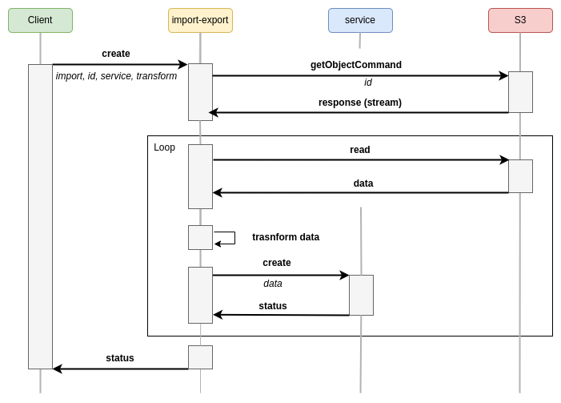
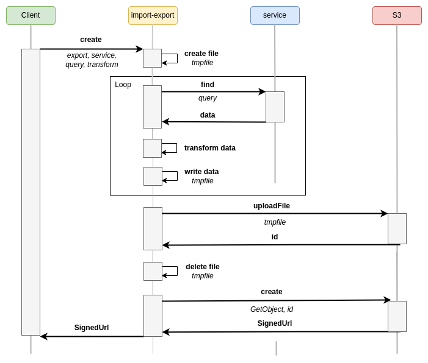

# feathers-import-export

**feathers-import-export** provides convenient methods to import/export to/from [Feathers services](https://feathersjs.com/api/services.html).

**feathers-import-export** has been specially designed to process large volumes of data and to overcome data transfer problems during import and export, it relies on the capabilities of the S3 API.

> [!WARNING]
> Consequently, the use of this library requires being able to operate a store compatible with the **S3 API**.

> [!NOTE]
> To deal with the objects in the stores, `feathers-import-export` relies on the [feathers-s3](https://github.com/kalisio/feathers-s3) library. It is highly recommended to read a little more about this library upfront.

## Principle

The following sections illustrate the different processes implemented by `feathers-import-export`:

### Import



### Export



## Installation

Install with your preferred package manager:

```shell
pnpm add @kalisio/feathers-import-export
```

```shell
npm install @kalisio/feathers-import-export
```

```shell
yarn add @kalisio/feathers-import-export
```

## Configuration

Assuming you have setup a Feathers app:

```js
// Import Feathers stufff
import { Service } from '@kalisio/feathers-import-export'

// Setup Feathers app
const options = {
  s3Options: {
    s3Client: {
      credentials: {
        accessKeyId: process.env.S3_ACCESS_KEY_ID,
        secretAccessKey: process.env.S3_SECRET_ACCESS_KEY
      },
      endpoint: process.env.S3_ENDPOINT,
      region: process.env.S3_REGION,
      signatureVersion: 'v4'
    },
    bucket: process.env.S3_BUCKET,
    allowedServicePaths: 'path/to/my/service' // a regular expression, or an array, used to validate the path to the requested service
    prefix: 'tmp' // a folder used to store imported/exporter files
  },
  app,
  workingDir: process.env.TMP_DIR,
}

app.use('import-export', new Service(options))
```

The `s3Options` options are described in [feathers-s3](https://github.com/kalisio/feathers-s3#constructor-options)

### Examples

#### Import data from a file

Import data from a `data.csv` file into the `my-service` service:

```js
const response = await app.service('import-export').create({
  method: 'import',
  id: 'key/to/the/file/in/the/bucket'   // file key into the bucket
  servicePath: 'path/to/service'        // path to the service where to import the data
})
```

> [!NOTE]
> This method assumes that you have already uploaded the file.

#### Export data to a file

Export data from the `my-service` service into the `data.csv` file:

```js
const response = await app.service('import-export').create({
  method: 'export',
  servicePath: 'path/to/my-service',
  filename: 'data.csv',
  format: 'csv'
})
```