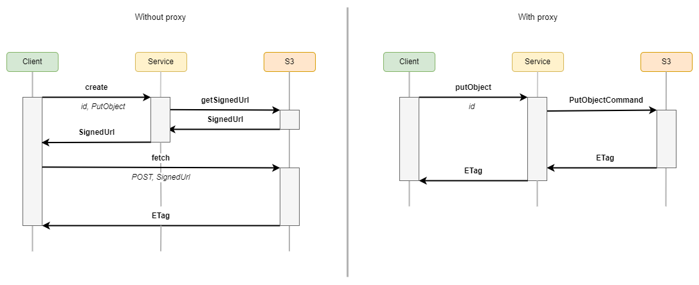
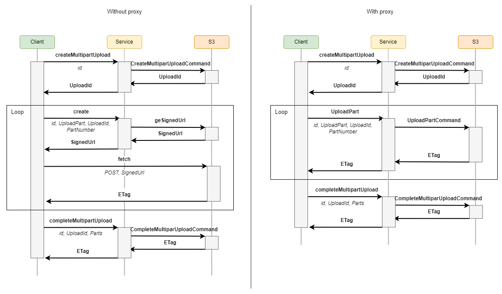
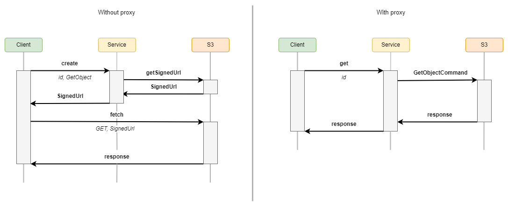

# feathers-s3

**feathers-s3** allows to deal with [AWS S3 API](https://docs.aws.amazon.com/AmazonS3/latest/API/Welcome.html) compatible storages to manage file upload/download in a FeathersJS application.

Unlike the solution [feathers-blob](https://github.com/feathersjs-ecosystem/feathers-blob), which provides a store abstraction, `feathers-s3` is limited to
be used with stores providing a S3 compatible API. However, it takes advantage of the **S3 API** by using [presigned URLs](https://docs.aws.amazon.com/AmazonS3/latest/userguide/using-presigned-url.html) to manage (upload, share) objects on a store in a more reliable and secure way.

Using **Presigned URL** has different pros and cons:

* Pros
  - It decreases the necessary resources of the server because the transfer process is established between the client and the S3 service.
  - It speeds up the transfer process because it can be easily parallelized.
  - It reduces the risk of your server becoming a bottleneck.
  - It supports multipart upload by design.
  - It is inherently secure.
* Cons
  - It involves extra complexity on the client side.
  - It requires your S3 bucket to have CORS enabled.
  - It requires your provider to support S3 Signature Version 4.
  - The access to the object is limited to a short time.

To address these drawbacks, `feathers-s3` provides:
* **Helper functions** to simplify usage from a client application.
* An [Express middleware](http://expressjs.com/en/guide/using-middleware.html) to directly access objects based on URLs without using **presignedl url**. There is no time constraint unlike with **presigned url** and you can also access only a portion of an object using [range requests](https://developer.mozilla.org/en-US/docs/Web/HTTP/Range_requests).
* A **proxy** mode that let you use **service methods** that don't rely on **presigned URL** in case your S3 provider doesn't support CORS settings or you'd like to [process data](README.md#data-processing) on your backend. In this case the objects are always transferred through your backend.

## Principle

The following sections illustrate the different process implemented by `feathers-s3`:

### Upload

The `upload` process can be a **singlepart** upload or a **multipart** upload depending on the size of the object to be uploaded. If the size is greater than a `chunkSize` (by default 5MB), `feathers-s3` performs a **multipart** upload. Otherwise it performs a **singlepart** upload.

#### Singlepart upload



#### Multipart upload



### Download



## Installation

Install with your preferred package manager:

```shell
pnpm add @kalisio/feathers-s3
```

```shell
npm install @kalisio/feathers-s3
```

```shell
yarn add @kalisio/feathers-s3
```

## Configuration

Here’s how to configure the `feathers-s3` service in your **FeathersJS** application:

```js
// Define the options used to instanciate the S3 service
const options = {
  s3Client: {
    credentials: {
      accessKeyId: process.env.S3_ACCESS_KEY_ID,
      secretAccessKey: process.env.S3_SECRET_ACCESS_KEY
    },
    endpoint: process.env.S3_ENDPOINT,
    region: process.env.S3_REGION,
    signatureVersion: 'v4'
  },
  bucket: process.env.S3_BUCKET,
  prefix: 'feathers-s3-example'
}
// Register the message service on the Feathers application
// /!\ do not forget to declare the custom methods
app.use('s3', new Service(options), {
  methods: ['create', 'get', 'find', 'remove', 'createMultipartUpload', 'completeMultipartUpload', 'uploadPart', 'putObject']
})
```

## Data processing

Some use cases might require you directly process the data on your server before sending it to the object storage, e.g. if you'd like to resize an image. You can do that by:
1. registering a [before hook](https://feathersjs.com/api/hooks.html) on the `putObject` custom method to process the data before sending it to the object storage,
2. using the [proxy mode](API/client.md) on the client side service to send the data to your server instead of the object storage,
3. defining the appropriate [`chunkSize`](API/client.md) on the client service to not use multipart upload as processing usually requires the whole content to be sent.

Here is a simple example relying on [sharp](https://sharp.pixelplumbing.com/) to resize an image:

```js
async function resizeImage (hook) {
  hook.data.buffer = await sharp(hook.data.buffer)
    .resize(128, 48, { fit: 'contain', background: '#00000000' }).toBuffer()
}

app.service('s3').hooks({
  before: {
    putObject: [resizeImage]
  }
})

// Here you can proceed as usual from server side
service.putObject({ id, buffer, type })
// or client side
clientService.upload(id, blob, options)
```

## Example

For a complete example, see the [feathers-webpush s3](https://github.com/kalisio/feathers-ekosystem/tree/master/examples/feathers-s3) in this repository.