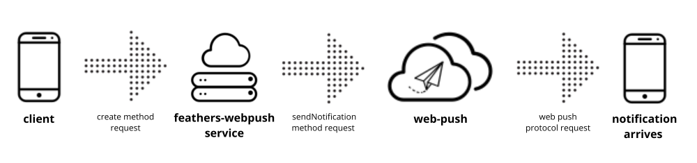

# feathers-webpush

**feathers-webpush** module provides a simplified way to send web push notifications in a FeathersJS application. It leverages the [web-push package](https://github.com/web-push-libs/web-push) to interact with the [Web Push protocol](https://web.dev/articles/push-notifications-web-push-protocol).



## Installation

```shell
pnpm add @kalisio/feathers-webpush
```

## Configuration

The provided [example](./example/README.md) illustrates how to setup:

* a server app

https://github.com/kalisio/feathers-webpush/blob/6b09d58428923c95e26cd5keycloak-listener8d130bc6b268c4cb30/example/server.mjs#L1-L46

* a client app

https://github.com/kalisio/feathers-webpush/blob/6b09d58428923c95e26cd58d130bc6b268c4cb30/example/src/index.html#L1-L66

https://github.com/kalisio/feathers-webpush/blob/6b09d58428923c95e26cd58d130bc6b268c4cb30/example/src/index.js#L1-L122