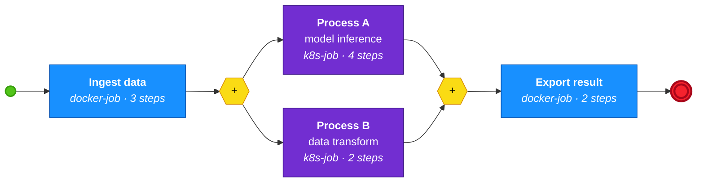

# feathers-bpmn-orchestration

BPMN-driven orchestration on top of [`@kalisio/feathers-tasks`](../../packages/feathers-tasks). Each BPMN `serviceTask` is routed — via the `meta:jobType` extension — to either a **Docker container** (created via [`dockerode`](https://github.com/apocas/dockerode)) or a **Kubernetes pod** (created via [`@kubernetes/client-node`](https://github.com/kubernetes-client/javascript)). One BPMN service task = one BullMQ job = one ephemeral container/pod.

For a simpler version without BPMN, see [`examples/feathers-tasks-orchestration`](../feathers-tasks-orchestration/).

## Architecture

```
┌──────────────────────────────────────────────────────────────────┐
│ Feathers server (this process)                                   │
│                                                                  │
│  POST /workflows                                                 │
│        │                                                         │
│        ▼                                                         │
│  WorkflowsService ──► WorkflowEngine (bpmn-moddle)               │
│                           │ parses BPMN, walks elements          │
│                           ▼                                      │
│                     TaskService ──► BullMQ queue (Redis)         │
│                           ▲                                      │
│                      QueueEvents                                 │
│                     completed ─► WorkflowEngine._advance()       │
│                     waiting   ─► Dispatcher router               │
│                                     │                            │
│                                     ▼                            │
│                  DockerDispatcher | KubernetesDispatcher         │
│                                     │ creates 1 runner per job   │
└─────────────────────────────────────┼────────────────────────────┘
                                      │
                        ┌─────────────┴─────────────┐
                        ▼                           ▼
                Docker container              Kubernetes pod
                (worker/run-job.js)           (worker/run-job.js)
                — picks one job, exits —      — picks one job, exits —
```

## BPMN workflow

The example [workflows/example.bpmn](workflows/example.bpmn) models a 4-step pipeline with a parallel branch:



Legend: 🟦 Docker container (dockerode)  ·  🟪 Kubernetes pod (K8s API)  ·  🟨 parallel gateway (split / join).

Each `serviceTask` carries two custom extension attributes:

| Attribute | Description |
|-----------|-------------|
| `meta:jobType` | Routes the job to the matching dispatcher (`docker-job` or `k8s-job`) |
| `meta:steps` | Number of simulated work steps (each step ≈ 500 ms) |

## Key files

| File | Role |
|------|------|
| [server/index.js](server/index.js) | Feathers app, queue wiring, dispatcher router, BPMN hooks |
| [server/workflow-engine.js](server/workflow-engine.js) | BPMN parser + state machine (`WorkflowEngine`, `WorkflowInstance`) |
| [server/workflows.service.js](server/workflows.service.js) | Feathers `workflows` service |
| [server/runners.service.js](server/runners.service.js) | Feathers `runners` service — tracks each container/pod |
| [server/dispatchers/docker.js](server/dispatchers/docker.js) | Docker container dispatcher (dockerode) |
| [server/dispatchers/kubernetes.js](server/dispatchers/kubernetes.js) | Kubernetes Job dispatcher |
| [worker/run-job.js](worker/run-job.js) | Ephemeral BullMQ worker — picks one job then exits |
| [workflows/example.bpmn](workflows/example.bpmn) | BPMN 2.0 process definition |
| [Dockerfile](Dockerfile) | Builds the worker image used by both dispatchers |

## Prerequisites

- **Node 20+**, **pnpm 10+**
- **Redis** on `localhost:6379`
- **Docker** with the daemon socket accessible (`/var/run/docker.sock`)
- **A local Kubernetes cluster** (`kind`, `k3d`, `minikube`, Docker Desktop, …) with a working `kubectl` context
- A common container image visible from both Docker and the K8s cluster

> The K8s dispatcher uses `imagePullPolicy: Never` by default. For clusters like `kind` you must `kind load docker-image feathers-tasks-worker:latest`. For `minikube`, build inside the VM (`eval $(minikube docker-env)`).

## Getting started

```bash
# 1 — Install dependencies (from the workspace root)
pnpm install

# 2 — Start Redis
redis-server

# 3 — Build the worker image (from the example folder)
cd examples/feathers-bpmn-orchestration
pnpm build:image

# 4 — (kind only) Load the image into the cluster
kind load docker-image feathers-tasks-worker:latest

# 5 — Start the server
pnpm dev:server
#   or auto-launch the example workflow on boot:
AUTORUN=1 pnpm dev:server
```

## Launching workflows

```bash
curl -X POST http://localhost:3030/workflows \
  -H 'Content-Type: application/json' \
  -d '{"name":"My workflow","bpmnFile":"./workflows/example.bpmn"}'
```

You can also POST the XML inline:

```bash
BPMN=$(cat workflows/example.bpmn | jq -Rs .)
curl -X POST http://localhost:3030/workflows \
  -H 'Content-Type: application/json' \
  -d "{\"name\":\"inline\",\"bpmnXml\":$BPMN}"
```

### Submit a standalone task (no BPMN)

```bash
curl -X POST http://localhost:3030/tasks \
  -H 'Content-Type: application/json' \
  -d '{"type":"docker-job","payload":{"label":"manual","steps":2}}'
```

## Observing state

| Endpoint | What you see |
|----------|--------------|
| `GET /workflows` | Workflow definitions + instance status (`running` / `completed` / `failed`) |
| `GET /tasks` | One record per BullMQ job |
| `GET /runners` | One record per container/pod, with orchestrator, id/name, status, timestamps |
| `http://localhost:3030/admin/tasks` | Bull Board UI |

Live container/pod visibility:

```bash
docker ps --filter label=feathers-tasks.job-id
kubectl get jobs,pods -l app=feathers-tasks-worker
```

## Configuration

Identical to the simpler example — see [`feathers-tasks-orchestration/README.md`](../feathers-tasks-orchestration/README.md#configuration-environment-variables). Additionally:

| Variable | Default | Description |
|----------|---------|-------------|
| `AUTORUN` | _(unset)_ | Set to any value to auto-launch `workflows/example.bpmn` on startup |

## How the BPMN engine works

### Parsing

[`bpmn-moddle`](https://github.com/bpmn-io/bpmn-moddle) converts the BPMN XML into an object graph. `WorkflowEngine.launch()` extracts the `bpmn:Process` root and builds a flat `elementMap` keyed by element id.

### State machine

`WorkflowInstance` walks the graph element by element:

1. **StartEvent** — follows the first outgoing `SequenceFlow`.
2. **ServiceTask** — reads `meta:jobType` / `meta:steps` from `extensionElements` and enqueues a BullMQ job. The BPMN-task → BullMQ-job mapping is stored in `jobToElement`.
3. **ParallelGateway (split)** — iterates over all outgoing flows concurrently.
4. **ParallelGateway (join)** — precomputes the expected incoming count; only advances when every branch has arrived.
5. **EndEvent** — marks the instance as `completed` and emits `instance-completed`.

### Job completion loop

```
Worker container / pod completes job
  → BullMQ emits 'completed' on QueueEvents
  → server handler reads workflowInstanceId from the result
  → WorkflowsService.notifyJobCompleted()
  → WorkflowInstance.onJobCompleted() resolves bpmnTaskId via jobToElement
  → WorkflowInstance._advance(bpmnTaskId) walks to the next BPMN element
```

### Failure handling

If a job fails, `QueueEvents` emits `'failed'`. The server patches the task record and calls `WorkflowsService.notifyJobFailed()`, which marks the instance as `failed`. No retry is implemented in this example.

## Dispatcher = lifecycle tracking

Because every job spawns a dedicated container/pod, the `runners` service lets you answer questions that a shared worker pool cannot:

- "Which container executed this specific job?" → `GET /runners?jobId=42`
- "How long did that pod live?" → `createdAt` / `startedAt` / `finishedAt`
- "Did the runtime exit cleanly?" → `status` + `exitCode`

This is the main reason the example moved away from long-running Swarm services / static K8s Deployments: **one object per job, directly observable**.

## Feathers services

| Service | Implementation | Purpose |
|---------|---------------|---------|
| `task-store` | `MemoryService` | BullMQ job metadata |
| `workflow-store` | `MemoryService` | Workflow definitions + instances |
| `tasks` | `TaskService` | BullMQ queue interface |
| `workflows` | `WorkflowsService` | BPMN orchestration (`create` parses + runs) |
| `runners` | `RunnersService` | Container/pod lifecycle |

All services publish real-time events on the `anonymous` Socket.IO channel.
